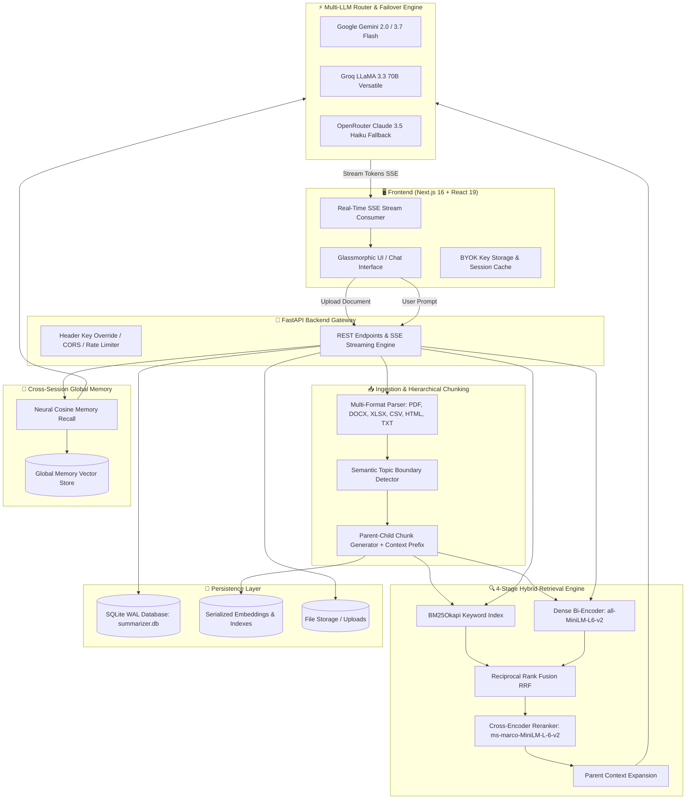

# 🧠 DocMind — Enterprise Document Intelligence & Global Memory

<div align="center">


### **Next-Generation Hierarchical RAG • Multi-LLM Failover • Cross-Session Neural Memory**

[](https://fastapi.tiangolo.com)
[](https://nextjs.org)
[](https://react.dev)
[](https://www.typescriptlang.org)
[](https://www.python.org)
[](https://pytorch.org)
[](https://www.docker.com)
[](LICENSE)

[**Explore Features**](#-key-features) • [**Architecture**](#-system-architecture) • [**Quick Start**](#-quick-start) • [**API Reference**](#-api-endpoints-reference) • [**Deployment**](#-production-deployment)

</div>

---

## 📖 Overview

**DocMind** is a production-grade, document-grounded intelligence platform designed for deep document analysis, question answering, and contextual synthesis. Built on an advanced **5-stage Hierarchical Retrieval-Augmented Generation (RAG)** pipeline, DocMind eliminates hallucinations with a strict document-first grounding protocol while retaining conversational context across separate chat sessions using **Global Cross-Session Neural Memory**.

Whether analyzing complex legal contracts, financial spreadsheets, research papers, or technical manuals, DocMind delivers accurate, cited answers with transparent relevance scoring and zero-downtime multi-LLM failover.

---

## ✨ Key Features

| Category | Feature | Description |
| :--- | :--- | :--- |
| 📑 **Document Ingestion** | **Multi-Format Parsing** | High-fidelity parsing of **PDF, DOCX, TXT, MD, HTML, CSV, and XLSX** with structural table and header extraction. |
| 🧩 **Chunking Strategy** | **Hierarchical Semantic Chunking** | Dual-layer parent (~512 tokens) and child (~128 tokens) chunking with semantic topic boundary detection and contextual prefix enrichment. |
| 🔍 **Search & Retrieval** | **Hybrid RRF + Neural Reranking** | Parallel **BM25Okapi** keyword search and **Dense Sentence Transformer** (`all-MiniLM-L6-v2`) combined via Reciprocal Rank Fusion, refined by a **Cross-Encoder** (`ms-marco-MiniLM-L-6-v2`). |
| 🌐 **Memory** | **Cross-Session Global Memory** | Neural memory engine indexing insights across chats to recall relevant historical context in new conversations. |
| 🛡️ **Grounding** | **Strict Anti-Hallucination Protocol** | Explicit document citations and transparent disclosure notices when queries fall outside the document scope. |
| ⚡ **Resilience** | **Cascading Multi-LLM Router** | Automatic fallback chain: **Google Gemini $\rightarrow$ Groq $\rightarrow$ OpenRouter** on rate limits (429), quota limits, or server errors. |
| 🎨 **User Experience** | **Modern Glassmorphic UI** | Next.js 16 + React 19 interface with real-time SSE streaming, particle background, 3D tilt effects, keyboard hotkeys, and dark theme. |
| 💾 **Data & Export** | **Multi-Format Export & WAL Storage** | Export full conversation transcripts to **Markdown, JSON, or Plain Text**. SQLite with Write-Ahead Logging (WAL) for concurrent read/writes. |

---

## 🏗️ System Architecture



---

## 🔬 Retrieval Pipeline Deep Dive

DocMind uses a refined 5-stage retrieval-augmented generation architecture:

```
[Raw Document] 
       │
       ▼
 1. Ingestion & Multi-Format Parsing (PyMuPDF, docx, pandas, lxml)
       │
       ▼
 2. Hierarchical Semantic Chunking
    ├── Parent Chunks (~512 tokens: preserves structural section integrity)
    ├── Child Chunks (~128 tokens: splits on semantic topic shifts)
    └── Contextual Prefix: "Context: [Doc: Title] [Section: Header] ..."
       │
       ▼
 3. Hybrid Candidate Retrieval (Parallel Execution)
    ├── BM25Okapi Sparse Keyword Score
    └── Bi-Encoder Dense Semantic Score (all-MiniLM-L6-v2)
       │
       ▼
 4. Reciprocal Rank Fusion (RRF)
    └── RRF_Score = 1/(60 + Rank_BM25) + 1/(60 + Rank_Dense)
       │
       ▼
 5. Cross-Encoder Joint Reranking (ms-marco-MiniLM-L-6-v2)
    └── Evaluates full query-candidate cross-attention pairs
       │
       ▼
 6. Parent Context Expansion & Global Memory Injection
    └── Full parent section + recalled cross-session memories fed into LLM
```

---

## 📂 Repository Structure

```
DocumentSummarizer/
├── backend/                        # FastAPI Backend Application
│   ├── chunker.py                  # Hierarchical semantic chunker & subword vectorizer
│   ├── config.py                   # Pydantic environment configuration
│   ├── document_parser.py          # Unified parser for PDF, DOCX, XLSX, CSV, HTML, TXT
│   ├── llm_router.py               # Cascading LLM router (Gemini → Groq → OpenRouter)
│   ├── main.py                     # FastAPI application routes, SSE streaming, lifecycle
│   ├── models.py                   # Pydantic schemas for requests and responses
│   ├── requirements.txt            # Python dependencies (PyTorch, transformers, FastAPI)
│   ├── retrieval.py                # BM25 + Dense + Cross-Encoder hybrid retriever
│   ├── session_store.py            # SQLite WAL store for sessions, messages & memory
│   ├── test_backend.py             # Comprehensive test suite for backend components
│   ├── Dockerfile                  # Production container definition for backend
│   └── .env.example                # Backend environment variable template
│
├── frontend/                       # Next.js 16 App Router Frontend
│   ├── public/                     # Static assets, icons, manifest
│   ├── src/
│   │   ├── app/
│   │   │   ├── globals.css         # Global design system, glassmorphism & typography
│   │   │   ├── layout.tsx          # Root layout & font configurations
│   │   │   ├── page.tsx            # Main application page & state orchestrator
│   │   │   └── error.tsx           # Graceful client error boundary
│   │   ├── components/
│   │   │   ├── EmptyState.tsx      # Interactive welcome view with sample prompts
│   │   │   ├── GlobalMemoryModal.tsx # Cross-session memory manager & search
│   │   │   ├── InteractiveBackground.tsx # GPU-accelerated ambient particle canvas
│   │   │   ├── KeyboardShortcutsModal.tsx # Hotkeys command guide
│   │   │   ├── MessageBubble.tsx   # Markdown chat bubbles, citations & copy actions
│   │   │   ├── Modals.tsx          # Document upload modal & API key settings modal
│   │   │   ├── NeuralWaveform.tsx  # Dynamic audio/AI waveform visualization
│   │   │   ├── PipelineModal.tsx   # Visual interactive RAG pipeline inspector
│   │   │   ├── Sidebar.tsx         # Conversation history, session actions & stats
│   │   │   └── TiltCard.tsx        # 3D interactive physics hover card
│   │   └── lib/
│   │       ├── api.ts              # Typed fetch client with SSE streaming support
│   │       └── types.ts            # TypeScript interfaces & data contracts
│   ├── package.json                # Frontend dependencies & Next.js scripts
│   └── Dockerfile                  # Multi-stage production container for frontend
│
├── data/                           # Runtime storage (git-ignored)
│   ├── indexes/                    # Persisted vector embeddings & BM25 caches
│   ├── uploads/                    # Securely stored uploaded files
│   └── summarizer.db               # SQLite database with WAL journal
│
├── docker-compose.yml              # Multi-service container orchestration
├── render.yaml                     # Render cloud infrastructure blueprint
└── README.md                       # Project documentation
```

---

## 🚀 Quick Start

### Prerequisites

Ensure you have the following installed:
- **Python 3.10+** (Python 3.11 recommended)
- **Node.js 18+** and **npm** / **pnpm**
- *(Optional)* **Docker** & **Docker Compose**

---

### Option 1: Local Development Setup

#### 1. Clone the Repository

```bash
git clone https://github.com/Sanju562586/DocMind.git
cd DocumentSummarizer
```

#### 2. Configure Backend

```bash
cd backend
python -m venv venv

# On Windows (PowerShell):
.\venv\Scripts\Activate.ps1
# On Linux / macOS:
source venv/bin/activate

# Install dependencies (CPU PyTorch optimized):
pip install --extra-index-url https://download.pytorch.org/whl/cpu -r requirements.txt

# Create your .env file
cp .env.example .env
```

Edit `backend/.env` with your API keys:
```env
GEMINI_API_KEY=your_gemini_api_key
GROQ_API_KEY=your_groq_api_key
OPENROUTER_API_KEY=your_openrouter_api_key
```

Run the backend server:
```bash
python main.py
# Or using uvicorn:
uvicorn main:app --host 127.0.0.1 --port 8000 --reload
```
> 📍 Backend will be available at **`http://127.0.0.1:8000`** (Interactive Docs: `http://127.0.0.1:8000/docs`)

#### 3. Configure Frontend

In a new terminal window:

```bash
cd frontend
npm install
npm run dev
```
> 📍 Frontend will be available at **`http://localhost:3000`**

---

### Option 2: Run with Docker Compose

Run the entire full-stack application with a single command:

```bash
docker-compose up --build -d
```

| Service | Port | URL |
| :--- | :--- | :--- |
| **Frontend UI** | `3000` | [http://localhost:3000](http://localhost:3000) |
| **Backend API** | `8000` | [http://localhost:8000](http://localhost:8000) |
| **API Docs (Swagger)** | `8000` | [http://localhost:8000/docs](http://localhost:8000/docs) |

To stop the containers:
```bash
docker-compose down
```

---

## ⚙️ Environment Variables Reference

### Backend (`backend/.env`)

| Variable | Default | Description |
| :--- | :--- | :--- |
| `GEMINI_API_KEY` | `""` | Google Gemini API Key (Primary LLM Provider) |
| `GROQ_API_KEY` | `""` | Groq Cloud API Key (Secondary High-Speed Failover) |
| `OPENROUTER_API_KEY` | `""` | OpenRouter API Key (Tertiary Claude/Llama Failover) |
| `GEMINI_MODEL` | `gemini-2.0-flash` | Gemini model identifier |
| `GROQ_MODEL` | `llama-3.3-70b-versatile` | Groq model identifier |
| `OPENROUTER_MODEL` | `anthropic/claude-3.5-haiku` | OpenRouter model identifier |
| `HOST` | `127.0.0.1` | Host address to bind the FastAPI server |
| `PORT` | `8000` | Port for the FastAPI server |
| `ALLOWED_ORIGINS` | `http://localhost:3000` | Comma-separated CORS allowed origins |
| `DATABASE_PATH` | `./data/summarizer.db` | Path to persistent SQLite database |
| `UPLOAD_DIR` | `./data/uploads` | Path for storing uploaded files |
| `INDEX_DIR` | `./data/indexes` | Path for serialized vector indexes |
| `MAX_FILE_SIZE_BYTES` | `52428800` | Maximum upload size in bytes (50 MB) |
| `RATE_LIMIT_CHAT` | `20/minute` | Rate limit for chat message requests |
| `RATE_LIMIT_SUMMARIZE` | `10/minute` | Rate limit for full document summarization |

---

## 📡 API Endpoints Reference

### Health & Diagnostics
- `GET /api/health` — Full system status and neural model initialization state.
- `GET /api/health/live` — Kubernetes / Docker liveness probe.
- `GET /api/health/ready` — Kubernetes readiness probe (returns `200` when models & DB are ready).
- `GET /api/stats` — Aggregated system metrics (sessions, documents, messages, words, chunks).

### Sessions & Documents
- `GET /api/sessions` — List all conversations with document metadata and message counts.
- `POST /api/sessions` — Create a new conversation session.
- `GET /api/sessions/{session_id}` — Retrieve details of a specific conversation.
- `PATCH /api/sessions/{session_id}/title` — Rename a conversation title.
- `DELETE /api/sessions/{session_id}` — Delete a conversation, attached documents, and vector index.
- `DELETE /api/sessions` — Clear all conversations and indexes.
- `POST /api/sessions/{session_id}/documents` — Upload and asynchronously parse/chunk/index a document.
- `GET /api/sessions/{session_id}/documents` — List documents attached to a specific session.
- `DELETE /api/documents/{doc_id}` — Remove a single document and update the session index.

### Intelligence & Streaming
- `POST /api/chat` — Send a query, retrieve RAG chunks & global memory, and stream SSE tokens.
- `POST /api/sessions/{session_id}/summarize` — Stream a structured executive summary of all session documents.

### Global Cross-Session Memory
- `GET /api/memory` — List all global cross-session memories.
- `DELETE /api/memory/{memory_id}` — Delete a specific memory item.
- `DELETE /api/memory` — Clear all cross-session memories.

---

## ⌨️ Keyboard Shortcuts

Accelerate your workflow with built-in hotkeys:

| Shortcut | Action | Scope |
| :--- | :--- | :--- |
| <kbd>Enter</kbd> | Send message | Chat Input |
| <kbd>Shift</kbd> + <kbd>Enter</kbd> | Insert new line | Chat Input |
| <kbd>Ctrl</kbd> / <kbd>⌘</kbd> + <kbd>B</kbd> | Toggle left sidebar | Global |
| <kbd>Ctrl</kbd> / <kbd>⌘</kbd> + <kbd>K</kbd> | Create new conversation | Global |
| <kbd>?</kbd> | Open Keyboard Shortcuts guide | Global |
| <kbd>Esc</kbd> | Close active modal / cancel inline edit | Global |
| **Double Click Title** | Rename active conversation inline | Top Navigation Bar |

---

## 🧪 Testing & Verification

DocMind includes a comprehensive test suite verifying session isolation, document parsing, hierarchical chunking, hybrid retrieval, and API endpoints:

```bash
cd backend
python test_backend.py
```

The test runner will validate:
1. **SessionStore & WAL Mode** — Multi-session isolation and memory persistence.
2. **DocumentParser** — Text extraction across TXT, Markdown, PDF, and CSV formats.
3. **HierarchicalSemanticChunker** — Parent/child splitting, token bounds, and contextual prefixing.
4. **HybridRetriever** — BM25 + Dense vector search, RRF scoring, and cross-encoder reranking.
5. **LLMRouter** — Fallback routing across provider chains.
6. **FastAPI Endpoints** — Live test client requests for health, sessions, upload, chat, and memory.

---

## 🚢 Production Deployment

### Deploy on Render

This repository includes a [`render.yaml`](render.yaml) blueprint for one-click deployment:

1. Push your code to GitHub.
2. Log in to [Render](https://render.com) and create a **New Blueprint Instance**.
3. Select your repository. Render will automatically build the backend using Python 3.11 with CPU-optimized PyTorch.
4. Add your `GEMINI_API_KEY`, `GROQ_API_KEY`, and `OPENROUTER_API_KEY` under Environment Variables.

### Deploy Frontend on Vercel

1. Import the `/frontend` directory into [Vercel](https://vercel.com).
2. Set the `NEXT_PUBLIC_BACKEND_URL` environment variable to your deployed backend URL (e.g., `https://docmind-backend.onrender.com`).
3. Deploy!

---

## 🔒 Security & Privacy

- **BYOK (Bring Your Own Key)**: Users can supply API keys directly from the UI. Keys are stored in client-side storage and transmitted over secure HTTPS headers (`X-Gemini-Key`, `X-Groq-Key`, `X-OpenRouter-Key`).
- **Path Traversal Protection**: Uploaded filenames are sanitized with regex to prevent directory traversal attacks.
- **Payload Validation**: Strict file size limits (50 MB default) and MIME-type verification prevent unauthorized file execution.
- **Rate Limiting**: Integrated SlowAPI rate limiting protects endpoints against brute-force and DDoS attempts.

---

## 🤝 Contributing

Contributions are welcome! Follow these steps to contribute:

1. Fork the repository.
2. Create a feature branch: `git checkout -b feature/amazing-feature`.
3. Commit your changes: `git commit -m 'feat: add amazing feature'`.
4. Push to the branch: `git push origin feature/amazing-feature`.
5. Open a Pull Request.

---

## 📄 License

This project is licensed under the **MIT License** — see the [LICENSE](LICENSE) file for details.

<div align="center">

**Built with ❤️ for intelligent document understanding.**

</div>
